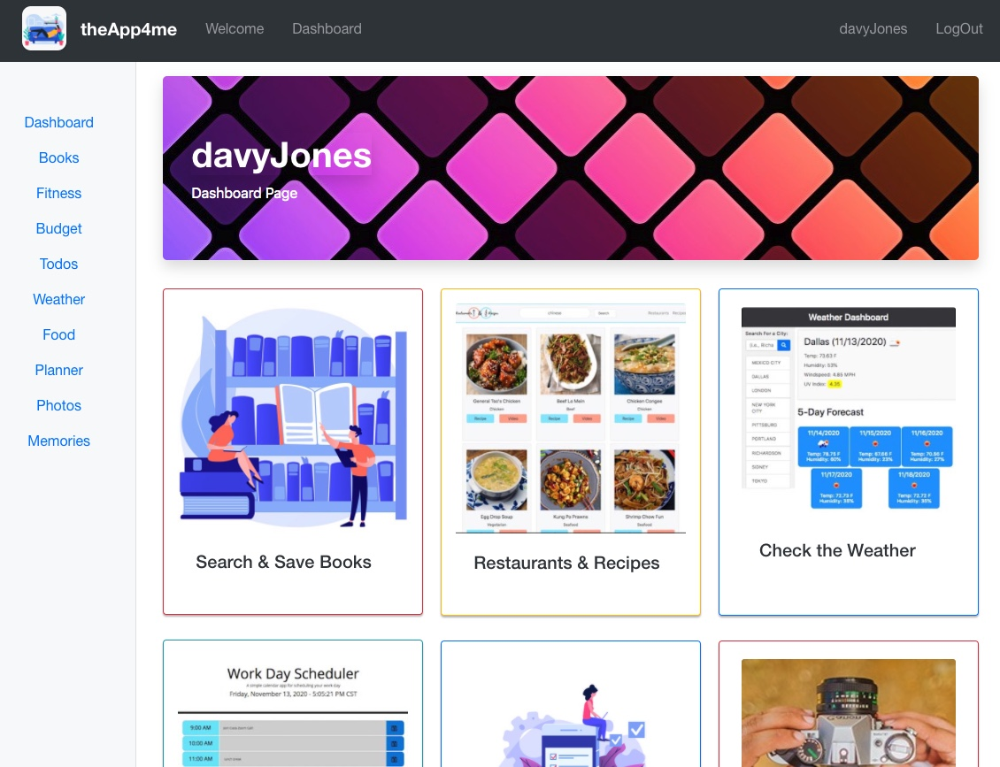

# theApp4me - React-Redux Personoal Dashboad, Application Suite

[](https://github.com/jdhprogrammer) [](https://github.com/jdhprogrammer/TheAppForMe) [](https://github.com/jdhprogrammer/TheAppForMe) [](https://choosealicense.com/licenses/mit/)

## Developer

### David Harris

Email: jdh.programmer@gmail.com  
GitHub: https://github.com/jdhprogrammer  
LinkedIn: https://www.linkedin.com/in/jdhprogrammer/  

Project Repository: [https://github.com/jdhprogrammer/TheAppForMe](https://github.com/jdhprogrammer/TheAppForMe)  
<br>
Project Deployment: [https://the-app-4-me.herokuapp.com/](https://the-app-4-me.herokuapp.com/)<br>


## Table of Contents

* [About the Project](#about-the-project)
  * [Description](#description)
  * [User Story](#user-story)
  * [More Details](#more-details)
  * [Technologies](#technologies)

* [Getting Started](#getting-started)
  * [Prerequisites](#prerequisites)
  * [Installation](#installation)
  * [Usage](#usage)

* [Contributing](#contributing)
* [Acknowledgements](#acknowledgements)
* [License](#license)
* [Contact](#contact)

## About The Project
  


### Description

```
theApp4me is a web and mobile application for Me and for You. It is primarily focused on your personal well being. It is about having 0ne place you can go during your day that is just for you. theApp4me keeps your life together and running the best it can!
```

#### User Story

```
Everyone's using theApp4me and loving it.
```

#### More Details

```
a place to Save Favorite Photos and write Posts about favorite Memories.
```

### Technologies Used

```
* React.  * Redux.  * Hooks.  * useState.  * useContext.  * useSelector.  * Redux-Thunk.  * MongoDB.  * Express Router.  * NodeJS.  * RESTful APIs.  * React-Bootstrap.  * and more....  
```


## Getting Started

### Prerequisites

have a computer or phone, or borrow one.

        
### Installation

currently... visit the website. 
  
### Usage
  
Visit the Website. Read through the Landing Page. Sign Up on the Sign up Page. Then log in with your username and password. Update account information on profile page. Learn about built-in applications on the Welcome page. Try out the features/apps on your Dashboard page.
  
  

## Contributing

Contributions are what make the open source community such an amazing place to be learn, inspire, and create. 
Any contributions you make are **greatly appreciated**.

1. Fork the Repo on GitHub @ [https://github.com/jdhprogrammer/TheAppForMe](https://github.com/jdhprogrammer/TheAppForMe) 
2. Create your Feature Branch ('git checkout -b feature/AmazingFeature')
3. Commit your Changes ('git commit -m "Add some AmazingFeature"')
4. Push to the Branch ('git push origin feature/AmazingFeature")
5. Open a Pull Request  
  
### Screenshots


  
### Acknowledgements

Dane Edwards, My Family, everyone who has come before me and shared their isssues and solutions on the web
  

## License

Distributed under the [MIT](https://choosealicense.com/licenses/mit/). See LICENSE for more information.
  

## Contact

David Harris - jdh.programmer@gmail.com

Project Link: [https://github.com/jdhprogrammer/TheAppForMe](https://github.com/jdhprogrammer/TheAppForMe)

<br>

Project Deployment: [https://the-app-4-me.herokuapp.com/](https://the-app-4-me.herokuapp.com/)<br>

Copyright © 2021 [DAVID HARRIS](https://github.com/jdhprogrammer)
  

  